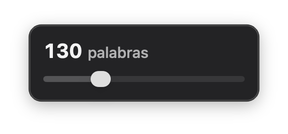

# Lorem Slider (v1.1.0)

A lightweight macOS menu bar lorem ipsum generator — drag a slider to the word count you need, let go, and it's already on your clipboard.



> Running an older version? Compare the number above to the one in **About Lorem Slider** (right-click the menu bar icon), then re-download `LoremSlider.app` from this repo if you're behind.

**Menu bar:** click the quote icon to open the panel; click it again to hide it. Once open, it stays floating on top of every other app (and every Space, including full-screen ones) until you close it yourself — nothing you click outside of it will dismiss it, so you can keep it parked on screen while you work. Drag it anywhere by its background; it stays put the next time you reopen it.

**Dock icon:** since this is a menu-bar-only app (no Dock tile while running), dragging `LoremSlider.app` onto the Dock yourself gives you a launcher shortcut rather than a live app tile. Clicking it opens the panel directly — on a cold launch and on every click after that, even while Lorem Slider is already running in the background.

**Panel:**
- Drag the slider (1–500) to the word count you want; releasing it generates that many words of lorem ipsum and copies it to the clipboard automatically — a "✓ Copied" note flashes to confirm it. The slider accelerates: the first half of the drag covers 1-100 words for fine control, the second half covers 101-500 for the rarer large counts
- Click the number or its caption to copy again without moving the slider — each copy starts from a different point in the source text, so repeating the same count doesn't paste the same words twice
- The last word count you picked is remembered between launches
- Interface defaults to English, with an automatic Spanish translation when your Mac's system language is Spanish

## How it works

The panel is a non-activating `NSPanel` at `.floating` window level, which is what lets it sit on top of whatever app you're using without ever stealing keyboard focus from it. It's positioned under the menu bar icon only the first time it's shown after launch; after that it stays exactly where you last dragged it for as long as the app keeps running (quitting and reopening Lorem Slider resets it back under the icon).

The word list cycles through a fixed lorem ipsum passage, so any count from 0 to 500 always returns exactly that many words.

## Requirements

- macOS 10.15 or later
- Xcode Command Line Tools (`xcode-select --install`)

## Download & run (no build required)

1. Download `LoremSlider.app` from this repo
2. Move it to your `/Applications` folder
3. Right-click → **Open** → **Open** (required once to bypass Gatekeeper on unsigned apps)

## Build from source

```bash
git clone https://github.com/bereto-dev/lorem-slider.git
cd lorem-slider
make
open LoremSlider.app
```

## First launch security

Because the app isn't signed or notarized (no Apple Developer account needed), macOS will block it the first time. Right-click → **Open** → **Open** to bypass Gatekeeper once.

## Settings

Right-click the menu bar icon → **Check for Updates…** / **About Lorem Slider** / **Quit Lorem Slider**. Inside the panel, the last word count you picked is remembered between launches (`UserDefaults`).

## Origin

Built by Roberto Pacheco for quickly grabbing a specific word count of lorem ipsum without opening a browser.

## Support

If you find Lorem Slider useful, you can buy me a coffee ☕

[](https://buymeacoffee.com/bereto)

Built by [devteam.partners](https://devteam.partners/about-us) 🌐

---

Built with Swift + AppKit. No external dependencies.
